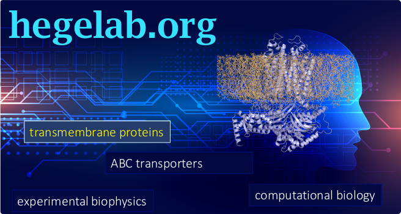

# BetaFold

We ([hegelab.org](http://www.hegelab.org)) craeted this standalone AlphaFold fork with substantial changes that most likely will not be inserted in the main repository, but we found these modifications very useful during our daily work. We plan to try to push these changes gradually to main repo via [our alphafold fork](https://github.com/hegelab/alphafold).

## Changes / Features

* It is called BetaFold, since there might be some minor bugs – we provide this code “as is”.
* This fork includes the correction of some memory issues from [our alphafold fork](https://github.com/hegelab/alphafold) (listed below below).
* The changes mostly affect the workflow logic.
* BetaFold run can be influence via **configuration files**.
* **Different steps of AF2 runs** (generating features; running models; performing relaxation) can be separated. Thus database searches can run on a CPU node, while model running can be performed on a GPU node. Note: timings.json file is overwritten upon consecutive partial runs – save it if you need it. 
* **Complexes** can be predicted by inserting “gaps”. Insert the sequences as one sequence into the fasta file and define the start and end of protomers in the configuration file (so easy). Important: at least ~40 a.a. difference should be in numbering between the end and start of two protomers. **Notes:**
	- This feature might be obsolete soon, after releasing the AF2-Multimer code and models.
	- Since AF library functions can handle only single chain and openMM requires all atoms at the starting and ending residues, we had to modify the amber relaxation function in the AF2 code. Therefore the unrelaxed and relaxed structures will not have the same atoms (therefore we also skipped the RMSD calculation). **Most imporant:** The relaxed/ranked pdb structures do not contain the pLDDT values. We will correct this soon - till you can use scripts/set_b_plddt.py to copy pLDDT values from unrelaxed to relaxed/ranked pdb files.

## Configuration file

* You can provide the configuration file as: ‘run_alphafold.sh ARGUMENTS -c CONF_FILENAME’ (slightly modified version of the bash script from [AlfaFold without docker @ kalininalab](https://github.com/kalininalab/alphafold_non_docker); please see below our Requirement section)
* If no configuration file or no section or no option is provided, everything is expected to run everything with the original default parameters.

```
[steps]
get_features = true
run_models = true
run_relax = true

[sequence_features]
protomers = 1-650:1001-1700

[paths]
db = /mnt/afold/db
pdb70_database_path = %(db)s/mypdb70/pdb70
# uniref90_database_path
# mgnify_database_path
# bfd_database_path
# uniclust30_database_path
# small_bfd_database_path
# template_mmcif_dir
# obsolete_pdbs_path

# TODO implement binary paths
output = /mnt/afold/afold_hegelab/results/SOMEDIR
tmp = %(output)s/tmp

[jackhmmer_uniref90]
do_run = true
max_hits = 10000

[jackhmmer_mgnify]
do_run = true
max_hits = 10000

[hhsearch_pdb70]
do_run = true
max_template_hits = 20
# TODO max_template_date = 

[hhblits_bfd_uniclust]
do_run = True
```

## Requirements

* BetaFold uses the [AlfaFold without docker @ kalininalab](https://github.com/kalininalab/alphafold_non_docker) setup.
* For the modified relaxation you need to install [pdbfixer]() as:
	- `git clone https://github.com/openmm/pdbfixer.git`
	- `cd pdbfixer`
	-  activate your conda environment (e.g. `conda activate betafold`)
	- `python3 setup.py install`

## Paper/Reference/Citation
Till we publish a methodological paper, please read and cite our preprint ["AlphaFold2 transmembrane protein structure prediction shines"](https://www.biorxiv.org/content/10.1101/2021.08.21.457196v1).

## Memory issues you may encounter when running original AlphaFold locally

### "Out of Memory"

Some of our AF2 runs with short sequences (~250 a.a.) consumed all of our memory (96GB) and died. Our targets in these cases were highly conserved and produced a very large alignment file, which is read into the memory by a simple .read() in `alphafold/data/tools/jackhmmer.py` ` _query_chunk`. Importantly, the max_hit limit is applied at a later step to the full set, which resides already in the memory, so this option does not prevent this error.
* To overcome this issue exhausting the system RAM, we read the .sto file line-by-line, so only max_hit will reach the memory.
* Since the same data needed line-by-line for a3m conversion, we merged the two step together. We inserted to functions into `alphafold/data/parsers.py`: `get_sto` if only sto is needed and `get_sto_a3m` if also a3m is needed (the code is somewhat redundant but simple and clean).
* This issue was caused by `jackhmmer_uniref90_runner.query` and `jackhmmer_mgnify_runner.query`, so we modified the calls to this function in `alphafold/data/pipeline.py`.
* The called `query` in `alphafold/data/tools/jackhmmer.py` calls `_query_chunk`; from here we call our `get_sto*`; `_query_chunk` returns the `raw_output` dictionary, which also includes 'a3m' as a string or None.

### "ValueError: Cannot create a tensor proto whose content is larger than 2GB."
(https://github.com/deepmind/alphafold/issues/71)
If your protein is highly conserved then the alignment may result in a large data set that does not fit TensorFlow's hard coded 2Gb limit. Theoretically, the call to `jackhmmer_uniref90_result` in `alphafold/data/pipeline.py` should be limited  to `uniref_max_hits: int = 10000`. However, this does not happen. You can find an [easy fix for this at alphafold.hegelab.org](http://alphafold.hegelab.org/) that avoid to use our forks. However, we also fixed other memory problems with the previous fix. So if you use our forks, this "ValueError...2GB" issue is obsolete for you.

## License and Disclaimer

Please see the [original](https://github.com/deepmind/alphafold#license-and-disclaimer).
